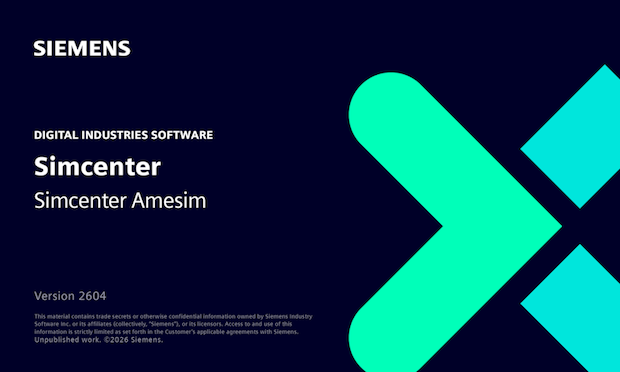
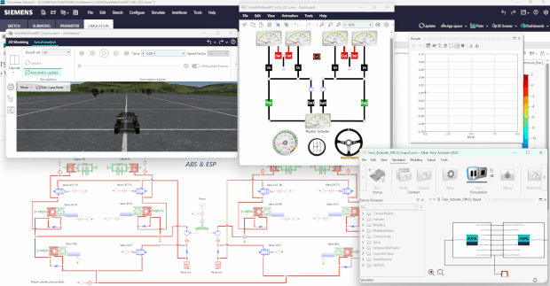



    



# Modelica Association Newsletter 2026-01

issued on March 5, 2026





    <i class="fa-regular fa-envelope" style="font-size:50px"></i>



## Letter from the Board



    <i class="fa-solid fa-building-columns" style="font-size:50px"></i>



## Modelica Association

<!-- END Modelica Association -->



    <i class="fa-solid fa-users" style="font-size:50px"></i>



## Conferences and user meetings

<!-- END Conferences and user meetings -->



    <i class="fa-solid fa-industry" style="font-size:50px"></i>



## Vendor news

### Siemens Digital Industries Software

#### Simcenter Amesim 2604 released
[Siemens Digital Industries Software](https://www.sw.siemens.com/) is pleased to announce the recent release of **Simcenter&nbsp;Amesim&nbsp;2604** as part of its [system simulation solutions](https://blogs.sw.siemens.com/simcenter/simcenter-systems-release-2604/). This release introduces key updates, notably:

* Major enhancements to the so-called **Battery Pack Assistant**, to further support electrification (modeling capabilities and workflow).
* Expanded **gas system simulation capabilities**, serving applications like pneumatic controls in industrial automation, compressors in HVAC systems, or specialized gas handling in extreme environments.

More detail can be found [here](https://blogs.sw.siemens.com/simcenter/simcenter-systems-release-2604/ ). Several changes have also been specifically applied to **exported&nbsp;FMUs**, in terms of <i>licensing policy</i> as well as <i>integration and collaboration capabilities</i>. These specific updates as described hereafter.  

#### Export of full-featured standalone (license-free) FMUs

The previous restriction on the specific export option allowing to create license-free (standalone) FMUs for Windows or Linux standard platforms has been removed. 

Prior to release 2604, such FMUs were limited to models without a solver (model exchange) or those using only a fixed-step solver (co-simulation). Now, this highly requested licensing policy change brings several key benefits:
* **Avoided rework**: users can now avoid the need to rework models or tune third-party solvers, which is especially useful for Model-in-the-Loop (MiL) applications.
* **Reliable deployment**: deploy validated **Simcenter&nbsp;Amesim** models with their native solver embedded, ensuring repeatable results.
* **Standalone apps**: create and share standalone applications leveraging **Simcenter&nbsp;Amesim**'s modeling and solving capabilities.

This means even large, sophisticated models with their native &mdash;&nbsp;best-adapted&nbsp;&mdash; solver can be deployed as lightweight FMUs (a few megabytes) with no external dependencies, which greatly facilitates model reuse and collaboration with partners, suppliers, or other departments.

#### Unified FMU export for real-time

To address the challenge of exporting, validating, and deploying FMUs for real-time simulation while avoiding fragmented workflows and/or late issue discovery, **Simcenter&nbsp;Amesim&nbsp;2604** now adds binaries for standard platforms (Windows and Linux), in addition to the source code for the chosen real-time target, within the exported &ldquo;FMUs for real-time&rdquo;. The compilation of these binaries is similar to that of the real-time target's toolchain. The expected concrete benefits for users are:
* **Easier pre-checks** (on Windows or Linux) before sharing FMUs to real-time target users.
* **Built-in continuity, consistency and traceability** (same FMU used <i>offline</i> and <i>online</i>).
* **No need for any external compiler** for generating/compiling these FMUs. 
* **Flexible deployment**: offline tests possible on machines with no **Simcenter&nbsp;Amesim** license or installation.

Each of these FMUs can be seen as a **unified model container** now also usable for offline tests in any FMI compatible software. This feature avoids the need to export multiple FMUs and represents a step towards unification of FMI based and Simulink based model export workflows of real-time capable **Simcenter&nbsp;Amesim** models. 

#### Export of 3.0 FMUs with arrays to represent vectors

With **Simcenter&nbsp;Amesim&nbsp;2604**, exporting 3.0 FMUs now includes support for fixed-size arrays. This enhancement allows users to easily create arrays by simply connecting vectored signals directly to and/or from export interface blocks. Arrays are a cornerstone feature of FMI 3.0, offering significantly simpler and more usable model layouts by reducing the need for numerous individual connections. For instance, the automotive application example below demonstrates two **Simcenter&nbsp;Amesim** 3.0 FMUs co-simulated within [**Simcenter&nbsp;Twin&nbsp;Activate**](https://altair.com/twin-activate ). Here, arrays conveniently group the vehicle's wheel speeds and brake forces as vectors, streamlining the connections between the FMUs.

For more information on **Simcenter&nbsp;Amesim**, please visit our [website](https://www.siemens.com/en-us/products/simcenter/systems-simulation/amesim/ ).

*This article is provided by Bruno Loyer ([Siemens Digital Industries Software](https://www.sw.siemens.com/ ))*

<!-- END Vendor news -->



    <i class="fa-solid fa-book" style="font-size:50px"></i>



## News from libraries

<!-- END News from libraries -->



    <i class="fa-solid fa-graduation-cap" style="font-size:50px"></i>



## Education news

<!-- END Education news -->
